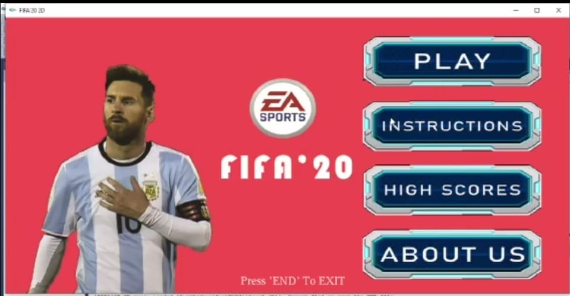
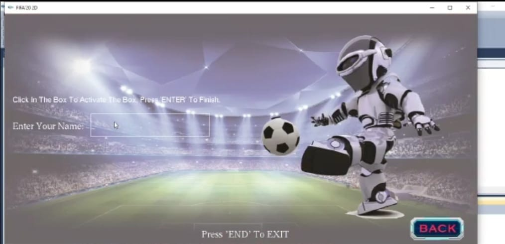
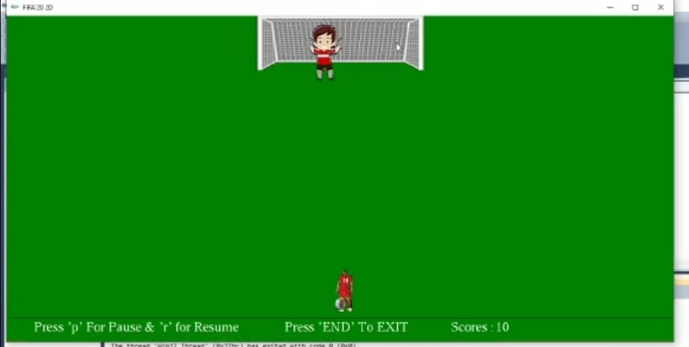
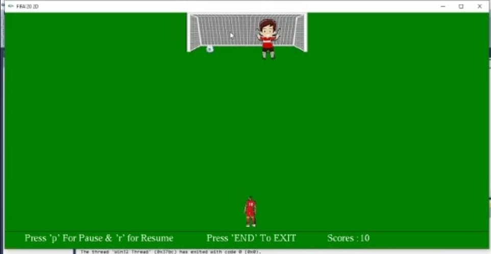

# FIFA 2020

FIFA 2020 is a 2D  game. The game made use of various iGraphics features. The foundational language is C++. The player needed to figure out a simple method of passing the ball on the goal bar without giving it to the goalkeeper. Straight and curved shots are the two categories. The curve shot gained additional points. 

## Screenshots

## Tech Stack
-iGraphics
-C++.
